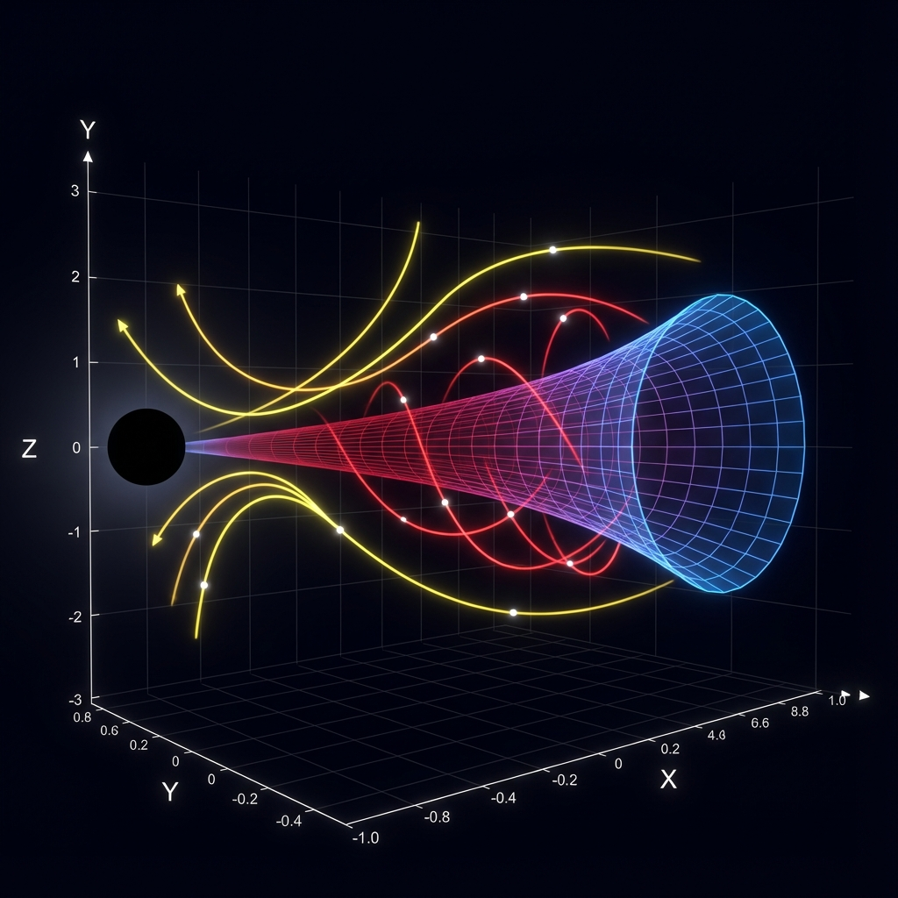
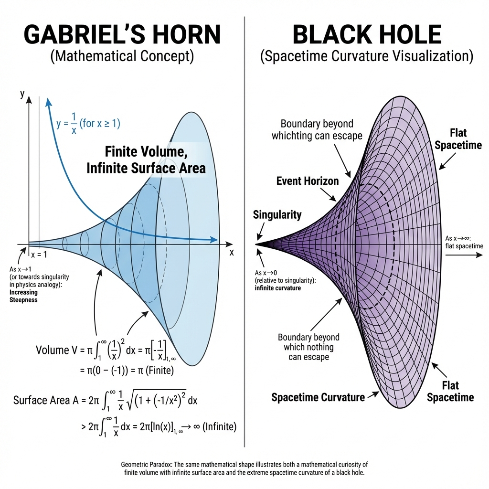
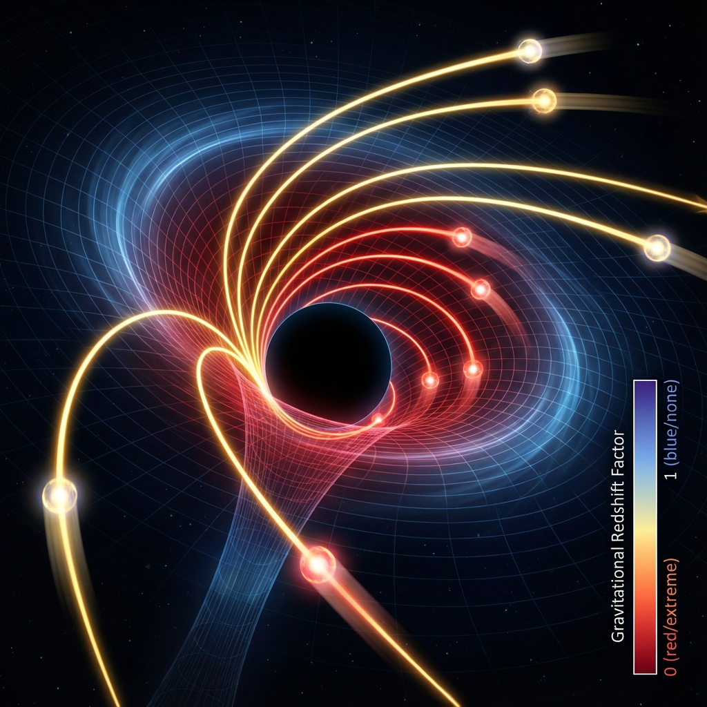

# Gabriel's Horn Paradox & Black Hole Singularity Visualization

An interactive 3D visualization that demonstrates the mathematical connection between **Gabriel's Horn** (Torricelli's Trumpet) paradox and **black hole spacetime curvature**, featuring animated light ray telemetry through curved spacetime.


## 📖 Overview

This program creates a stunning interactive visualization that illustrates:

- **Gabriel's Horn Paradox**: A mathematical surface with **finite volume** but **infinite surface area**
- **Black Hole Spacetime**: How gravity curves spacetime near a black hole
- **Gravitational Redshift**: Visual representation using color gradients
- **Photon Geodesics**: Animated light rays traveling through curved spacetime
- **Event Horizon**: The boundary where escape velocity equals the speed of light
- **Photon Sphere**: The region where gravity is strong enough that photons are forced into orbits

## 📸 Visualization Preview


*Interactive 3D visualization showing Gabriel's Horn geometry with gravitational redshift colors and animated photon geodesics*

## 🎯 The Paradox Connection

**Gabriel's Horn** is created by rotating the curve `y = 1/x` around the x-axis. It has the remarkable property of having:
- **Finite volume** (converges to π)
- **Infinite surface area** (diverges logarithmically)

This mirrors the properties of **black hole singularities**:
- As `x → 0` (approaching the singularity): radius → ∞ (infinite curvature)
- As `x → ∞` (far from the black hole): radius → 0 (flat spacetime)


*Mathematical connection between Gabriel's Horn paradox and black hole spacetime geometry*

## ✨ Features

### Interactive Controls
- **Event Horizon Radius**: Adjust the Schwarzschild radius
- **Spacetime Curvature**: Change the scale of the Gabriel's Horn geometry
- **Camera Controls**: Azimuth, elevation, and zoom
- **Auto-Rotate**: Automatic 360° camera rotation
- **Show/Hide Light Rays**: Toggle light ray visualization

### Animation
- **▶️ Play**: Animate photons traveling through spacetime
- **⏸️ Pause**: Freeze animation and display complete light ray paths
- **🔄 Reset**: Return all parameters to default values

### Color-Coded Physics
- 🔴 **Red regions**: Extreme gravitational redshift (near event horizon)
- 🟣 **Purple regions**: Moderate gravitational effects (transition zone)
- 🔵 **Blue regions**: Weak gravitational effects (far from black hole)
- ⚫ **Black sphere**: Event horizon (point of no return)

### Light Ray Visualization (Now in 3D!)
- 🟡 **Yellow rays**: Photons that escape the black hole's gravity
- 🟠 **Orange rays**: Critical scattering (strong lensing) near photon sphere
- 🔴 **Red rays**: Photons captured by the black hole
- 🔵 **Cyan sphere**: Photon sphere at 1.5x Schwarzschild radius
- ⭕ **Bright markers**: Real-time photon position indicators


*Animated photon geodesics showing how light travels through curved spacetime - yellow rays escape, orange rays scatter, while red rays spiral inward*

## 🚀 Installation

### Prerequisites
- Python 3.7 or higher
- pip package manager

### Install Dependencies

```bash
pip install -r requirements.txt
```

Or install packages individually:

```bash
pip install numpy matplotlib scipy
```

## 💻 Usage

Run the visualization:

```bash
python gabriel_horn_singularity.py
```

### Controls

Once the visualization opens:

1. **Use the sliders** at the bottom to adjust:
   - Event horizon radius (0.5 - 5.0)
   - Spacetime curvature (0.1 - 2.0)
   - Camera azimuth (0° - 360°)
   - Camera elevation (-90° - 90°)
   - Zoom level (0.3 - 2.0)

2. **Click buttons** to control animation:
   - **Play**: Start light ray animation
   - **Pause**: Stop animation
   - **Reset**: Return to default settings

3. **Check boxes** for toggles:
   - Show/hide light rays
   - Enable/disable auto-rotation

## 🔬 Physics Concepts

### Schwarzschild Metric
The visualization uses the **Schwarzschild metric** to calculate gravitational redshift:

```
redshift_factor = √(1 - rs/r)
```

Where:
- `rs` = Schwarzschild radius (event horizon)
- `r` = radial distance from black hole center

### Photon Geodesics
Light rays follow **geodesic paths** in curved spacetime, calculated using simplified Schwarzschild geodesic equations. The program numerically integrates these equations using the Runge-Kutta method (`scipy.integrate.solve_ivp`).

### Event Horizon
The **event horizon** is located at the Schwarzschild radius:

```
rs = 2GM/c²
```

Where:
- `G` = gravitational constant
- `M` = black hole mass
- `c` = speed of light

## 📊 Technical Details

### Key Functions

- `gabriel_horn()`: Generates the Gabriel's Horn geometry
- `schwarzschild_metric()`: Calculates gravitational redshift factor
- `photon_geodesic_schwarzschild()`: Computes photon trajectories
- `calculate_light_ray()`: Integrates geodesic equations numerically
- `black_hole_visualization()`: Main interactive visualization function

### Technologies Used

- **NumPy**: Numerical computations and array operations
- **Matplotlib**: 3D plotting and animation
- **SciPy**: Differential equation solving (ODE integration)

## 🎨 Visual Design

The visualization employs several aesthetic techniques:

- **Color mapping**: Uses `coolwarm` colormap for gravitational redshift
- **Transparency**: Alpha blending for depth perception
- **Smooth shading**: Anti-aliased surfaces for visual quality
- **Dynamic lighting**: Shade effects on surfaces
- **Annotations**: Labels for key features (singularity, event horizon)

## 🎓 Educational Value

This program is ideal for:

- Understanding **general relativity** concepts
- Visualizing **spacetime curvature**
- Learning about **mathematical paradoxes**
- Exploring **photon trajectories** near massive objects
- Teaching **gravitational lensing** and **redshift**

## 🤝 Contributing

Contributions are welcome! Feel free to:

- Report bugs
- Suggest new features
- Submit pull requests
- Improve documentation

## 📝 License

This project is licensed under the MIT License - see the [LICENSE](LICENSE) file for details.

## 🙏 Acknowledgments

- Inspired by Einstein's **General Theory of Relativity**
- Gabriel's Horn paradox discovered by **Evangelista Torricelli** (1608-1647)
- Schwarzschild solution discovered by **Karl Schwarzschild** (1916)

## 📧 Contact

For questions or suggestions, please open an issue on GitHub.

---

**Enjoy exploring the fascinating connection between mathematics and black hole physics! 🌌✨**
